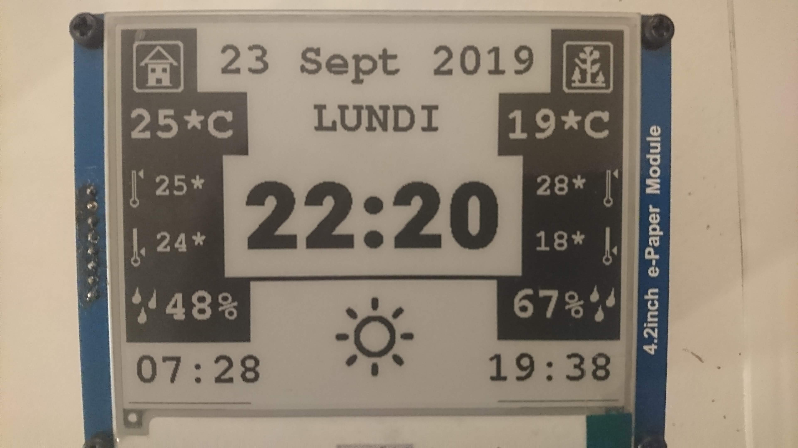
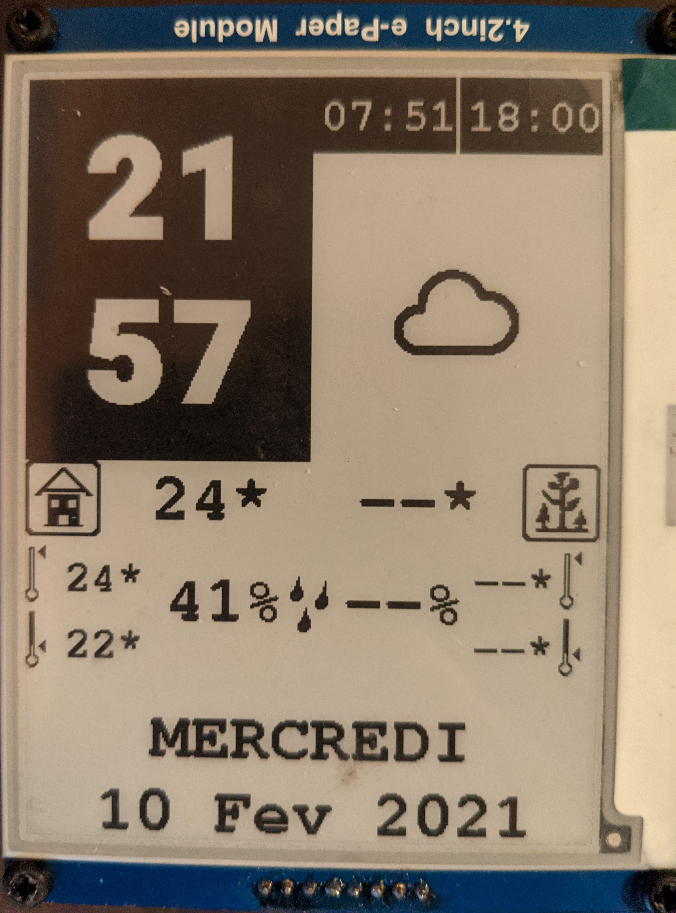
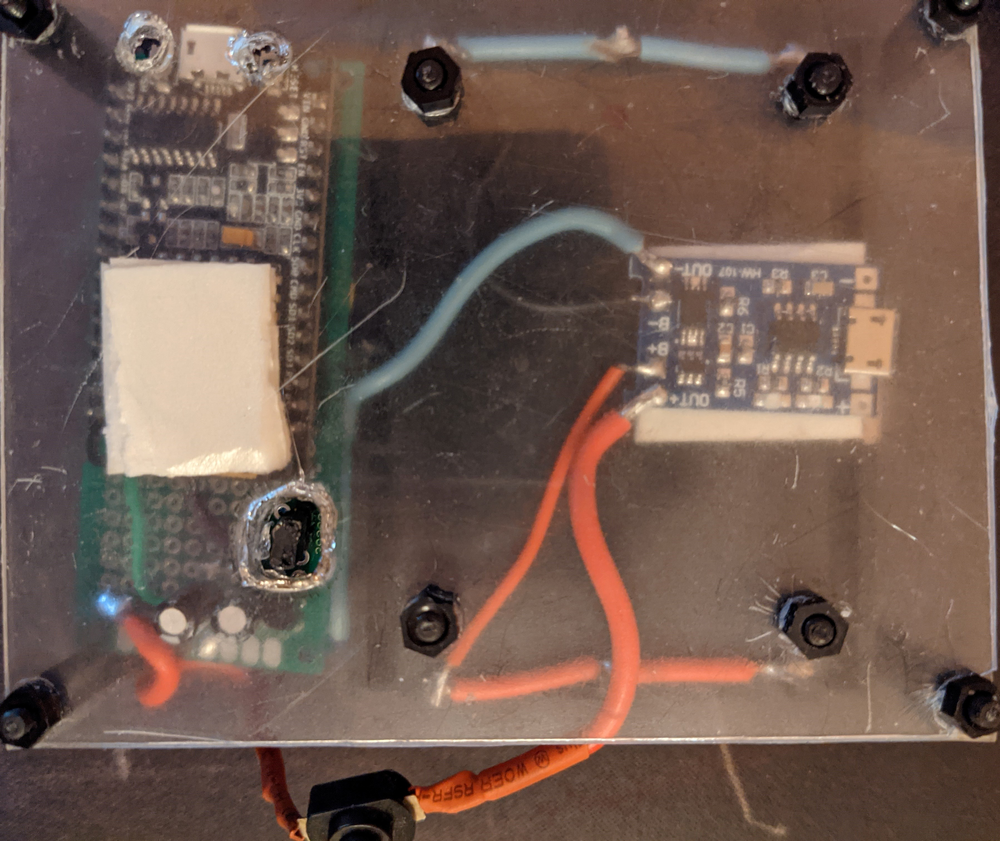
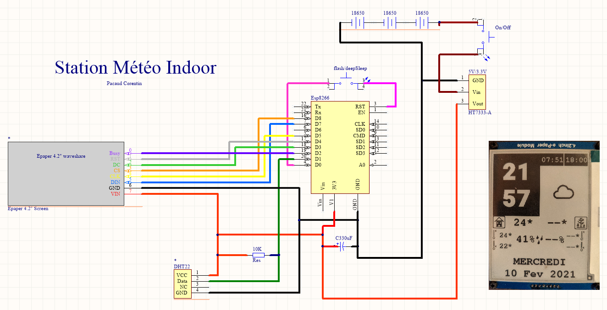

# WEATHER STATION - E-INK SCREEN

Horizontal layout | Vertical Layout
:----------|-----------:
 | 
 | <--------------------Back side

## Introduction

This project requires **NO 3D printer**, no particular tool other than a soldering iron.
It doesn't use RTC module, basically, juste ESPs, screen and sensors.

This weather station can display : 
- Current time / date
- Indoor and outdoor :
  - current temperature
  - current humidity
  - max/min temperature from 24h
- current weather
- time of sunrise and sunset

**Parts needed** : 
- ESP8266(x2) or ESP32 (x2) (caution: code is for ESP8266) : ~4$
- 18650 li-ion batteries (x3) : free for me (recycled from old laptop battery); or a Li-Ion (like RC vehicule, or other DIY project)
- some cables, resistances...
- TP4056 Module (microUSB charger) (x2) : ~0.30$ x 2;
- a piece of acrylique plate : I use 2mm but recommand 4mm.
- Some nylon M3 spacers : ~3$ a box.
- 4.2 e-ink screen from waveshare : ~30$
- a good 4.0V -> 3.3V converter like HT7333. Better this converter is, better is the life span of the battery. Chose a LDO (Low Drop Out).
- a small plastic box (9cm x 6.5cm x 3cm) for outdoor sensor.
- DHT22 (or DHT22) (x2) : ~2.45$ each

**Optionnal part** : 
- triple 18650 li-ion holder: x1
- single 18650 li-ion holder: x1

## Schematics

 

***
## Screen to ESP8266
| SCREEN | ESP8266 |
|:----------:|:-----------:|
| BUSY (violet) | D2|
| RST (blanc)   | D4|
| DC (vert)     | D3|
| CS (orange)   | D8|
| CLK (jaune)   | D5|
| DIN (bleu)    | D7|
| GND (noir)    | gnd|
| VCC (rouge)   | 3.3v|

***
## DHT22 to ESP8266

| DHT22| ESP-8266 |
|:----------:|:-----------:|
| DATA | D1 |
| GND  | gnd|
| VCC  | 3.3v|

New features :
- Wifi manager : no need to add your SSID/PWD in the config.h file
- Vertical layout

Next update :
- with change of openweather, add weather alert and corresponding icon